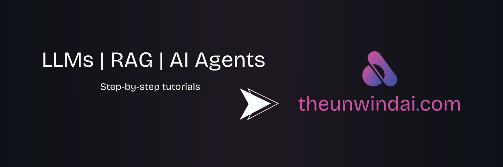

 
---

````html
<p align="center">
  <a href="https://github.com/Jastivenkatesh">
    
  </a>
</p>

<p align="center">
  <a href="https://www.linkedin.com/in/venkatesh-jasti-276308365">
    
  </a>
  <a href="https://x.com/captain_venky45">
    
  </a>
</p>

<p align="center">
  <a href="https://www.readme-i18n.com/Jastivenkatesh/Awesome-llm-Apps4?lang=de">Deutsch</a> | 
  <a href="https://www.readme-i18n.com/Jastivenkatesh/Awesome-llm-Apps4?lang=es">Español</a> | 
  <a href="https://www.readme-i18n.com/Jastivenkatesh/Awesome-llm-Apps4?lang=fr">français</a> | 
  <a href="https://www.readme-i18n.com/Jastivenkatesh/Awesome-llm-Apps4?lang=ja">日本語</a> | 
  <a href="https://www.readme-i18n.com/Jastivenkatesh/Awesome-llm-Apps4?lang=ko">한국어</a> | 
  <a href="https://www.readme-i18n.com/Jastivenkatesh/Awesome-llm-Apps4?lang=pt">Português</a> | 
  <a href="https://www.readme-i18n.com/Jastivenkatesh/Awesome-llm-Apps4?lang=ru">Русский</a> | 
  <a href="https://www.readme-i18n.com/Jastivenkatesh/Awesome-llm-Apps4?lang=zh">中文</a>
</p>

<hr/>

# 🌟 Awesome LLM Apps

A curated collection of **Awesome LLM apps built with RAG, AI Agents, Multi-agent Teams, MCP, Voice Agents, and more.**

This repository features LLM apps that use models from:

- OpenAI  
- Anthropic  
- Google Gemini  
- xAI  
- Open-source models like Qwen and Llama  

---

## 🤔 Why Awesome LLM Apps?

- 💡 Discover real-world LLM applications  
- 🔥 Learn Multi-Agent & RAG architectures  
- 🎓 Explore production-ready AI systems  

---

## 🚀 Getting Started

### Clone Repository
```bash
git clone https://github.com/Jastivenkatesh/Awesome-llm-Apps4.git
````

---

### Navigate to Project

```bash
cd Awesome-llm-Apps4
```

---

### Install Dependencies

```bash
pip install -r requirements.txt
```

---

## 👨‍💻 Maintained By

### ⭐ Jasti Venkatesh

🔗 GitHub
[https://github.com/Jastivenkatesh](https://github.com/Jastivenkatesh)

🔗 LinkedIn
[https://www.linkedin.com/in/venkatesh-jasti-276308365](https://www.linkedin.com/in/venkatesh-jasti-276308365)

🔗 Twitter / X
[https://x.com/captain_venky45](https://x.com/captain_venky45)

---

⭐ Star this repository to stay updated with latest LLM applications!

````

---

# ✅ After Updating README
Run this:

```bash
git add README.md
git commit -m "Updated README with personal branding"
git push
````

---

# ⭐ Suggestion (Important)

Since this is originally open-source project, it is **better practice to keep credit** like:

```
Original Repo Credit: jasti venkatesh
```

 
